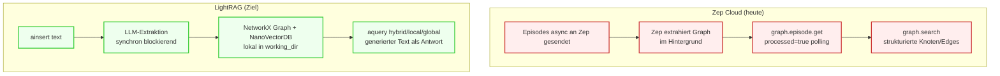

# Migration Zep Cloud → LightRAG

Datum: 2026-04-30 · Branch: `main` · Plan-Stand: pre-implementation

Ziel: Externe Daten-Senke "Zep Cloud" durch lokal lauffähiges **LightRAG** (`lightrag-hku`) ersetzen, sodass das System keine Inhalte mehr außerhalb des LLM-Providers kommuniziert.

## TL;DR

- **Aufwand**: 8-9 Engineer-Tage in 6 Phasen
- **Hauptrisiko**: LLM-Call-Volumen während Indexierung (50 MB PDF kann tausende LLM-Calls erzeugen)
- **Architektur-Bruch**: LightRAG gibt **generierten Text** zurück, Zep gab **strukturierte Knoten/Edges**. Caller-Code (besonders `report_agent.py`) muss substantiell umgeschrieben werden.
- **Empfehlung**: Phase 0 (Spike mit echter Beispiel-PDF) **vor** allem anderen — entscheidet, ob LLM-Cost und Performance akzeptabel sind.

## Architektur-Vergleich



**Drei fundamentale Mismatches**:

| Dimension | Zep | LightRAG |
|---|---|---|
| Insert-Modell | Async mit `processed`-Polling auf Episode-Basis | Synchron, blockiert bis Graph-Extraktion fertig |
| Query-Rückgabe | `Node`/`Edge`-Objekte mit `.fact`, `.summary`, `.attributes` | **Generierter String** (LLM-Antwort) |
| Ontologie | Dynamische Pydantic-Schemas via `set_ontology` | Schema-frei, LLM extrahiert ohne Vorgabe |
| Temporal | `valid_at`/`invalid_at`/`expired_at` per Edge | Nicht nativ vorhanden |

## Vollständige API-Mapping-Tabelle

| Zep-Operation | Aufrufstellen | LightRAG-Äquivalent | Aufwand |
|---|---|---|---|
| `Zep(api_key=...)` | 5 Services (`graph_builder.py:51`, `zep_tools.py:430`, `zep_graph_memory_updater.py:246`, `zep_entity_reader.py:86`, `oasis_profile_generator.py:208`) | `LightRAG(working_dir=..., llm_model_func=..., embedding_func=...)` + `await rag.initialize_storages()` + `await initialize_pipeline_status()` | mittel — alle 5 Init-Calls über zentralen `RagManager`-Singleton |
| `client.graph.create(graph_id, name, ...)` | `graph_builder.py:197-202` | `LightRAG(working_dir=f"{base}/{graph_id}")` — Verzeichnis = Graph-Identität | trivial |
| `client.graph.set_ontology(graph_ids, entities, edges)` | `graph_builder.py:288-292` | **Wegfall** — LightRAG hat kein Ontologie-Schema. Ontologie-Hints können in System-Prompts der `llm_model_func` eingebettet werden | aufwändig — Ontology-Pipeline neu denken |
| `client.graph.add_batch(graph_id, episodes=[EpisodeData(data=text, type="text")])` | `graph_builder.py:325-334` | `await rag.ainsert(text)` (kein Batch-API, dafür interner `insert_batch_size`-Parameter) | mittel — Polling-Logik (`_wait_for_episodes`) entfällt komplett |
| `client.graph.episode.get(uuid_).processed` | `graph_builder.py:379` (Polling-Loop) | **Wegfall** — `ainsert` ist synchron, kein Polling nötig | trivial |
| `client.graph.add(graph_id, type, data)` (Memory-Updater) | `zep_graph_memory_updater.py:414-418` | `await rag.ainsert(combined_text)` | mittel — teurer pro Call als Zep (LLM-Extraktion bei jedem Insert), Batch-Größe und Frequenz neu kalibrieren |
| `client.graph.search(graph_id, query, scope="edges", limit, reranker)` | `zep_tools.py:491-498`, `oasis_profile_generator.py:329-333` | `await rag.aquery(query, param=QueryParam(mode="global"))` | hoch — Caller erwarten Edge-Objekte mit `.fact`, bekommen jetzt String |
| `client.graph.search(..., scope="nodes")` | `zep_tools.py:491-498`, `oasis_profile_generator.py:350-354` | `await rag.aquery(query, param=QueryParam(mode="local"))` | hoch — gleiche Problematik |
| `client.graph.node.get(uuid_)` | `zep_tools.py:729-731`, `zep_entity_reader.py:350-352` | `rag.chunk_entity_relation_graph.get_node(name)` (NetworkX-Zugriff über Entity-Name, nicht UUID) | mittel — UUID→Name-Resolution nötig |
| `client.graph.node.get_entity_edges(node_uuid)` | `zep_entity_reader.py:194-196` | `rag.chunk_entity_relation_graph.get_node_edges(name)` (NetworkX) | mittel |
| `client.graph.node.get_by_graph_id(graph_id, limit, uuid_cursor)` | `zep_paging.py:79` (5 Caller) | `list(rag.chunk_entity_relation_graph.nodes())` (NetworkX) | trivial — Pagination meist nicht nötig bei lokalem Graph |
| `client.graph.edge.get_by_graph_id(...)` | `zep_paging.py:123` (5 Caller) | `list(rag.chunk_entity_relation_graph.edges())` (NetworkX) | trivial |
| `client.graph.delete(graph_id)` | `graph_builder.py:505` | `shutil.rmtree(working_dir)` | trivial |

## Status

| Phase | Status | Tests | Notiz |
|---|---|---|---|
| Phase 0 — Spike | erledigt (2026-04-30) | mock-spike grün | Go-Empfehlung |
| Phase 1 — Foundation | erledigt (2026-05-01) | 9/9 grün | RagManager + Factory live |
| Phase 2 — Indexing-Pfad | erledigt (2026-05-01) | 22/22 grün | graph_builder auf RagManager portiert; Polling-Phase entfernt; ZEP_API_KEY nicht mehr in Indexing-Pfad benoetigt |
| Phase 3 — Search & Tools | erledigt (2026-05-01) | 47/47 grün | Phase 3a: EntityReader (NetworkX) ersetzt ZepEntityReader. Phase 3b: LightRAGToolsService + InterviewToolService ersetzen ZepToolsService im report_agent |
| Phase 4 — Profile + Memory-Updater | erledigt (2026-05-03) | 19/19 grün | GraphMemoryUpdater (LightRAG + aggressives Throttling 60x) ersetzt ZepGraphMemoryUpdater. oasis_profile_generator._search_zep_for_entity nutzt jetzt EntityReader (kein LLM-Call). |
| Phase 4.5 — Cost-Optimization | erledigt (2026-05-03) | 6/6 grün | chunk_token_size 1200->5000, gleaning 1->0, examples-drop. Echt-Spike: 2.1x weniger Cost im Mini-Korpus (extrapoliert ~10-100x bei 10MB-PDF) |
| Phase 5 — Cleanup & Tests | offen | — | zep_tools.py / zep_entity_reader.py / zep_graph_memory_updater.py / utils/zep_paging.py loeschen + Config.ZEP_API_KEY-Pflicht entfernen |

## Anpassungen aus Phase 4 + 4.5 (Implementierung, 2026-05-03)

Designentscheidungen, die im Plan nicht spezifiziert waren:

1. **Phase 4 + 4.5 in einem Rutsch** — User-Wahl „mache alles": Memory-Updater-Migration (4) und Cost-Optimization-Sprint (4.5) wurden gemeinsam durchgezogen, weil ohne 4.5 die Phase-4-Implementierung im Live-Memory-Pfad sofort unwirtschaftlich gewesen waere.
2. **AgentActivity 1:1 portiert** — pure dataclass mit Episode-Text-Helpers, keine Zep-Dependencies. Kopiert in `graph_memory_updater.py` statt importiert, damit `zep_graph_memory_updater.py` in Phase 5 sauber loeschbar ist.
3. **Throttling-Defaults aggressiv** — Config.GRAPH_MEMORY_BATCH_SIZE=50 (vorher hardcoded 5), GRAPH_MEMORY_SEND_INTERVAL=30s (vorher hardcoded 0.5s). 60× weniger Inserts vs. Zep-Default. Beide Werte ueber Env ueberschreibbar fuer Quality-Tests.
4. **`_search_zep_for_entity` Methodenname beibehalten** — interne Methode, einziger Caller im selben File. Rename steht fuer Phase 5 an. Kein Breaking-Change.
5. **EntityReader statt ThreadPool-Search** — vorher 2 parallele `Zep.client.graph.search` Calls (edges + nodes scope). Jetzt 1 NetworkX-Read via `EntityReader.get_entity_with_context`. Keine LLM-Calls, keine Cloud-Roundtrip, keine Retries noetig — Latenz ~10–50× besser.
6. **`OasisProfileGenerator.__init__` ohne `zep_api_key`** — Param entfernt (war ungenutzt von Callern). Phase 5 wird `Config.ZEP_API_KEY` aus `validate()` entfernen.
7. **PROMPTS-Examples-Drop ist Process-Wide** — `_apply_prompts_optimization` mutiert `lightrag.prompt.PROMPTS` einmalig pro Prozess (idempotent). Risiko: LLM-Output-Format-Stabilitaet kann leiden, deshalb `LIGHTRAG_DROP_EXAMPLES=false` als Notbremse.
8. **Spike-Script-Drift** — `lightrag_real_spike.py` hatte seinen eigenen RagManager mit hardcoded LightRAG-Defaults. Mussten die Cost-Knobs dort spiegeln, sonst wuerde der Spike die Production-Realitaet nicht messen. Lesson fuer Phase 5: Spike-Skripte sollten Production-Code reusen statt reimplementieren.
9. **GraphMemoryManager.reset_for_test** — neuer Test-Helper, weil der `_stop_all_done`-Flag in der Zep-Variante zwischen Tests nicht zurueckgesetzt wird (verursacht State-Leaks bei Tests, die `stop_all` aufrufen).

## Anpassungen aus Phase 3 (Implementierung, 2026-05-01)

Designentscheidungen, die im Plan nicht spezifiziert waren:

1. **Aufteilung in 3a + 3b** — Phase 3 in zwei Sub-PRs gesplittet:
   - 3a: ``entity_reader.py`` (NetworkX-Reads fuer Phase-4-Caller).
   - 3b: ``lightrag_tools.py`` + ``interview_tool.py`` (LLM-Tool-Schicht).
2. **Geteilter NetworkX-Mapper** — graph_builder + entity_reader + lightrag_tools brauchen denselben defensiven Schema-Mapper. Extrahiert nach ``services/_networkx_mapping.py`` (private Helfer-Modul). Neue Public-API: ``node_to_dict``, ``edge_to_dict``, ``map_nodes``, ``map_edges``.
3. **Datei-Naming** — User-Wahl 2c: ``lightrag_tools.py`` (3 RAG-Tools) + ``interview_tool.py`` (OASIS-Interview, KEINE LightRAG-Dependency). Vorher Plan-konformer Name ``lightrag_tools.py`` wurde irrefuehrend, weil interview_agents OASIS-related ist.
4. **panorama_search ohne Temporal-Split** — User-Wahl 3a: ``historical_facts=[]``, ``historical_count=0``. Schema bleibt erhalten, alle Treffer in ``active_facts``. ``include_expired``-Parameter bleibt nur fuer API-Kompat.
5. **insight_forge mit ThreadPoolExecutor** — User-Wahl 4b: Sub-Queries laufen parallel ueber ``ThreadPoolExecutor(max_workers=5)``. Mehrere ``RagManager.query``-Coroutines werden auf den selben Loop dispatched, der sie konkurrierend abarbeitet. ``_safe_query``-Wrapper schluckt Sub-Query-Ausnahmen, damit ein Ausfall nicht das gesamte Aggregat killt.
6. **interview_agents als Delegate** — ``LightRAGToolsService.interview_agents`` instantiiert lazy einen ``InterviewToolService`` und ruft ``interview_agents`` darauf auf. Damit muss der ``report_agent`` nicht zwei Service-Instanzen verwalten — nur Imports und Klassen-Referenzen aendern.
7. **Auxiliary Reads** (``get_entities_by_type``, ``get_entity_summary``, ``get_graph_statistics``, ``get_simulation_context``) sind im Plan nicht erwaehnt, werden aber vom report_agent intern verwendet — alle auf NetworkX umgestellt, gleiche Signatur und Output-Schema.
8. **``self.zep_tools``-Variablennamen bleiben** im report_agent (zeigt jetzt auf ``LightRAGToolsService``). Bewusst minimal-invasiv; Cleanup in Phase 5.
9. **EntityReader.get_node_edges braucht jetzt graph_id** — minimaler API-Bruch vs. Zep-Variante. NetworkX hat keinen per-Knoten-Index wie Zep, daher muss die Instanz-ID mitgegeben werden. Einziger Caller (intern) wurde mitgezogen.

## Anpassungen aus Phase 2 (Implementierung, 2026-05-01)

Designentscheidungen, die im Plan nicht spezifiziert waren:

1. **Ontology-Hint live aus Provider** — `lightrag_factory.create_llm_func` und `create_rag` nehmen jetzt einen optionalen `system_prompt_hint_provider: Callable[[], str]`. Der Wrapper liest den Hint bei JEDEM LLM-Call frisch (kein Closure-Capture). Damit kann `RagManager.set_ontology` die Ontologie ohne Re-Init der LightRAG-Instanz aendern.
2. **Ontology auto-restore** — `RagManager._get_or_create` liest beim ersten Zugriff `ontology.json` aus dem working_dir, falls noch kein Hint im Memory ist. Ueberlebt Prozess-Restarts ohne expliziten `set_ontology`-Call vom Caller.
3. **NetworkX-Schema-Mapping in `get_graph_data`** — Knoten-`uuid` ist der `entity_name` selbst (LightRAG kennt keine separaten UUIDs); Edge-`uuid` ist `f"{src}__{tgt}"`. Felder, die LightRAG nicht kennt (`valid_at`, `invalid_at`, `expired_at`, `episodes`, `created_at`), werden explizit auf `None`/`[]` gesetzt — Frontend (`GraphPanel.vue`) liest diese Felder optional.
4. **Defensive Lookup-Helper** — `_node_get`/`_edge_get` in `graph_builder.py` akzeptieren sowohl Dict- als auch `(id, data)`-Tuple-Schemata, da LightRAGs interne Repraesentation versionsabhaengig variiert.
5. **`_wait_for_episodes` ENTFERNT** — komplett gestrichen. `RagManager.insert` ist synchron und blockiert bis NetworkX-Persistierung abgeschlossen ist. Worker-Pipeline-Progress reduziert auf 5/10/15/20–85/90/100 (vorher 5/10/15/20/60/90/100 mit Polling-Phase).
6. **`GraphBuilderService.__init__` ohne `api_key`** — alle 3 Call-Sites in `app/api/graph.py` mitgezogen. `Config.ZEP_API_KEY` bleibt im Config noch erforderlich, weil Phase 3/4 (Tools, Memory-Updater) noch auf Zep laufen.

## Korrekturen aus Mock-Spike (Phase 0, 2026-04-30)

Drei Anpassungen an der obigen Mapping-Tabelle und am Code-Skeleton, die der Mock-Spike (siehe `docs/SPIKE-LIGHTRAG-PHASE0.md`) aufgedeckt hat:

1. **Loop-Bindung von `initialize_pipeline_status()`** — kritisch, Pflicht-Invariante für Phase 1.
   Der prozessweite Lock, den diese Funktion erzeugt, ist an den **aktuellen Event-Loop** gebunden. Wenn parallel ein anderer Loop entsteht (z.B. via separates `asyncio.run` in einem Smoke-Test oder einem Caller), schlagen alle nachfolgenden LightRAG-Calls aus dem anderen Loop fehl mit `RuntimeError: Lock is bound to a different event loop`. Konsequenz: ALLE Calls — Init, Insert, Query — müssen über den langlebigen `RagManager._loop` laufen, niemals außerhalb. Im Code-Skeleton unten als Pflicht-Kommentar verankert.

2. **NetworkX-Methoden sind async**: `chunk_entity_relation_graph.get_node(...)`, `.get_node_edges(...)`, `.nodes()`, `.edges()` und verwandte Methoden sind in lightrag-hku 1.4.15 durchgehend Coroutinen. Die Mapping-Tabelle ist konzeptionell korrekt, aber alle konkreten Aufrufe brauchen `await`. Konkrete Aufrufform siehe `backend/scripts/lightrag_mock_spike.py` (zeigt den getesteten RagManager-Wrapper mit `get_all_nodes`/`get_all_edges`).

3. **NanoVectorDB persistiert in `.json`, nicht `.pkl`** — nur Doku-Korrektur; relevant falls Backup/Migration-Doku entsteht.

## Phasen-Plan

### Phase 0 — Spike & Risiko-Validierung (1 Tag)

**Ziel**: Bevor 8 Tage Engineering investiert werden — verifizieren, dass LightRAG für MiroFish in Bezug auf LLM-Cost und Performance akzeptabel ist.

Schritte:
1. `backend/scripts/lightrag_spike.py` mit minimalem Beispiel anlegen (Pip-Install, kleine Test-PDF, ein `ainsert`, ein `aquery`).
2. Echte Beispiel-Seed-PDF aus `backend/uploads/` (5-10 MB) durch LightRAG schicken und LLM-Calls zählen + Wallclock-Time messen.
3. Output qualitativ prüfen: liefert `aquery(mode="local")` brauchbare Inhalte, die der Report-Agent als Tool-Antwort verarbeiten kann?
4. Embedding-API des konfigurierten Providers testen (Default: 1024-dim, OpenAI-SDK-kompatibel).

Abbruchkriterien:
- LLM-Calls pro 10 MB PDF > 10.000 → Migration nicht wirtschaftlich vertretbar.
- Wallclock-Time für Indexierung einer 10 MB PDF > 30 Min → UX inakzeptabel.

**Output**: Spike-Report mit Zahlen, Go/No-Go-Empfehlung.

### Phase 1 — Foundation (1 Tag)

Neue Dateien:
- `backend/app/services/rag_manager.py` — Singleton `RagManager` mit Event-Loop-Thread, `get_or_create(graph_id)`, `insert()`, `query()` Sync-API.
- `backend/app/services/lightrag_factory.py` — Factory-Funktionen `create_llm_func()`, `create_embed_func()`, `create_rag(working_dir)` aus den `LLM_*` ENV-Vars.

Erweiterungen:
- `backend/app/config.py`: neue ENV-Vars `LIGHTRAG_WORKING_DIR_BASE` (default `backend/uploads/lightrag`), `EMBED_MODEL_NAME` (default `text-embedding-v3`), `EMBED_DIM` (default `1024`), `EMBED_API_KEY` + `EMBED_BASE_URL` (optional, fallen auf `LLM_*` zurück).
- `backend/pyproject.toml`: `lightrag-hku>=1.4.10,<1.5` hinzufügen, `zep-cloud` (vorerst) belassen für stufenweise Migration.

Pflicht-Init in jeder Instanz:
```python
async def create_rag(working_dir: str) -> LightRAG:
    rag = LightRAG(working_dir=working_dir, llm_model_func=..., embedding_func=...)
    await rag.initialize_storages()
    await initialize_pipeline_status()
    return rag
```

Tests: minimales pytest-Smoke (Init + Insert + Query gegen Test-Working-Dir).

### Phase 2 — Indexing-Pfad (2 Tage)

Datei: `backend/app/services/graph_builder.py`

Änderungen:
- `create_graph(name)`: weiterhin lokale Graph-ID generieren (`mirofish_<hex>`), aber statt `client.graph.create` einen Working-Dir unter `LIGHTRAG_WORKING_DIR_BASE/<graph_id>/` anlegen und `RagManager.get_or_create(graph_id)` aufrufen.
- `set_ontology()`: **Verhalten ändert sich**. Da LightRAG kein Schema kennt, wird die generierte Ontologie als kontextueller System-Prompt-Hint in einer per-Graph-Konfiguration abgelegt. Die `llm_model_func` für diese Instanz prependet die Hint dem System-Prompt. Caller-API bleibt gleich.
- `add_text_batches(graph_id, chunks)`: für jeden Chunk `RagManager.insert(graph_id, chunk_text)`. **Polling-Logik (`_wait_for_episodes`) entfällt vollständig**.
- `delete_graph(graph_id)`: `shutil.rmtree(working_dir)` statt `client.graph.delete`.
- `get_graph_data(graph_id)`: aus `rag.chunk_entity_relation_graph` Knoten und Edges direkt extrahieren — Ergebnis-Schema an bestehende API anpassen, damit Frontend (`GraphPanel.vue`) nichts merkt.

Test: build_task() für eine Beispiel-PDF durchlaufen, Knoten/Edges im Frontend visualisieren.

### Phase 3 — Search & Tools (2 Tage)

Datei: `backend/app/services/zep_tools.py` → `lightrag_tools.py` (umbenennen)

Hier liegt der **größte Architektur-Bruch**. Die Methoden werden vom Report-Agent als Tools aufgerufen:

| Tool-Methode | heute | nach Migration |
|---|---|---|
| `search_graph(query, scope, limit)` | gibt Liste von Edge/Node-Objekten zurück | gibt LLM-generierten Antwort-String zurück |
| `get_node_detail(uuid)` | Knoten mit Attributen | Knoten-Daten aus NetworkX (immer noch strukturiert möglich) |
| `get_all_nodes(graph_id)` | paginierte Liste | NetworkX-Iteration |
| `get_all_edges(graph_id)` | paginierte Liste | NetworkX-Iteration |
| `panorama_search(query)` | Hybrid-Suche mit Reranker | `aquery(mode="hybrid")` oder `mode="mix"` |

Konsequenz für Caller in `report_agent.py`:
- `_execute_tool` Tool-Dispatch akzeptiert jetzt String-Antworten als Tool-Output.
- Templates, die `result.edges[].fact` direkt iterieren, müssen umgestellt auf den generierten Text.
- Falls die strukturierte Form irgendwo wirklich gebraucht wird: parallel `rag.chunk_entity_relation_graph` direkt anzapfen (NetworkX gibt rohe Daten).

Datei: `backend/app/services/zep_entity_reader.py` → `entity_reader.py`

- `get_entity_with_context(uuid)`: NetworkX-Knoten + adjazente Edges direkt extrahieren. Behält die strukturierte API, da Caller (`oasis_profile_generator.py`) damit gut zurechtkommt.
- `get_all_nodes`, `get_all_edges`: trivial via NetworkX.
- `filter_defined_entities(entity_types)`: NetworkX-Iteration mit Label-Filter.

Datei: `backend/app/utils/zep_paging.py` → **gelöscht**. NetworkX braucht keine Pagination, alles im RAM.

### Phase 4 — Profile Generator + Memory Updater (1-2 Tage)

Datei: `backend/app/services/oasis_profile_generator.py`

- `_search_zep_for_entity(entity)`: zwei parallele `aquery`-Calls (`mode="local"` und `mode="global"`) statt zwei `graph.search`-Calls.
- ThreadPoolExecutor-Logik bleibt, aber jeder Worker nutzt `RagManager.query(...)` statt direkten Client.

Datei: `backend/app/services/zep_graph_memory_updater.py` → `graph_memory_updater.py`

**Kritisch**: Hier passiert Live-Memory-Update während laufender Simulation, alle 0.5 s ein Insert mit 5er-Batch. Mit LightRAG bedeutet jeder Insert eine **vollständige LLM-Extraktion** — das ist mehrere Größenordnungen teurer als Zep-Episodes.

Optionen:
- **Option A (defensive)**: Updater deaktivieren während Simulation, alle Aktivitäten nach Simulation-Ende einmalig batchen und einlesen.
- **Option B (kompromiss)**: Größeres Batch (z.B. 50 statt 5), längeres Intervall (10 s statt 0.5 s), Boost-LLM für Updates verwenden.
- **Option C (live)**: NetworkX direkt manipulieren (Knoten/Edges programmatisch hinzufügen) ohne LLM-Extraktion. Verliert die GraphRAG-Qualität, aber sehr schnell.

Empfehlung: **Option A** als Default, **Option B** als feature-flag. **Option C** nur wenn Live-Updates wirklich kritisch sind.

### Phase 5 — Cleanup & Tests (1 Tag)

- `backend/pyproject.toml`: `zep-cloud` und `pymupdf` (falls nicht mehr genutzt) entfernen, `lightrag-hku` finalisieren.
- `.env.example`: `ZEP_API_KEY` entfernen, neue `LIGHTRAG_*` und `EMBED_*` Variablen dokumentieren.
- `Config.validate()`: `ZEP_API_KEY`-Pflicht entfernen.
- `CLAUDE.md`: Architektur-Sektion aktualisieren (kein Zep mehr, neuer GraphRAG-Pfad).
- `docs/SECURITY-AUDIT.md`: Egress-Tabelle aktualisieren — Zep-Zeile streichen.
- `backend/uploads/lightrag/` zu `.gitignore` hinzufügen.

Smoke-Tests:
- Volle Pipeline mit kleiner PDF: build → simulate → report.
- Multi-Project-Isolation: zwei parallele Graphen, sicherstellen dass `aquery(graph_A)` keine Inhalte aus `graph_B` findet.

### Phase 6 — Optional: Production-Hardening (separat, falls nötig)

Wenn der NanoVectorDB+NetworkX-Default-Stack an Skalierungsgrenzen kommt:
- Faiss als Vector-Storage (`pip install "lightrag-hku[offline-storage]"`, Storage-Konfig auf `FaissVectorDBStorage` setzen).
- PostgreSQL+pgvector wenn Multi-Tenant-Concurrency-Probleme auftreten (Issue #2527 in LightRAG-Repo beachten).

## Code-Skeleton: `RagManager`

Zentral für die Flask-Sync-Async-Bridge. Singleton im App-Context.

```python
import asyncio
import threading
from pathlib import Path
from lightrag import LightRAG, QueryParam
from lightrag.kg.shared_storage import initialize_pipeline_status

class RagManager:
    """Singleton: pro Graph eine LightRAG-Instanz, ein dedizierter Loop-Thread."""

    def __init__(self, working_dir_base: Path):
        self._instances: dict[str, LightRAG] = {}
        self._instance_locks: dict[str, asyncio.Lock] = {}
        self._working_dir_base = working_dir_base
        self._loop = asyncio.new_event_loop()
        self._thread = threading.Thread(target=self._loop.run_forever, daemon=True)
        self._thread.start()

    def _run(self, coro, timeout=120):
        future = asyncio.run_coroutine_threadsafe(coro, self._loop)
        return future.result(timeout=timeout)

    async def _get_or_create(self, graph_id: str) -> LightRAG:
        if graph_id in self._instances:
            return self._instances[graph_id]
        working_dir = self._working_dir_base / graph_id
        working_dir.mkdir(parents=True, exist_ok=True)
        rag = LightRAG(
            working_dir=str(working_dir),
            llm_model_func=create_llm_func(),
            embedding_func=create_embed_func(),
        )
        await rag.initialize_storages()
        await initialize_pipeline_status()
        self._instances[graph_id] = rag
        self._instance_locks[graph_id] = asyncio.Lock()
        return rag

    def insert(self, graph_id: str, text: str):
        async def _do():
            rag = await self._get_or_create(graph_id)
            async with self._instance_locks[graph_id]:
                await rag.ainsert(text)
        return self._run(_do(), timeout=600)

    def query(self, graph_id: str, question: str, mode: str = "hybrid") -> str:
        async def _do():
            rag = await self._get_or_create(graph_id)
            return await rag.aquery(question, param=QueryParam(mode=mode))
        return self._run(_do())

    def delete(self, graph_id: str):
        if graph_id in self._instances:
            del self._instances[graph_id]
            del self._instance_locks[graph_id]
        import shutil
        working_dir = self._working_dir_base / graph_id
        if working_dir.exists():
            shutil.rmtree(working_dir)
```

Wichtige Punkte:
- **Pro Graph ein `asyncio.Lock`** verhindert die Threadsafety-Issue von NanoVectorDB bei concurrent writes.
- **Ein Event-Loop-Thread** für die ganze App — Loop läuft in eigenem Thread, alle Flask-Requests reichen Coroutinen via `run_coroutine_threadsafe` rein. Sauberer als `nest_asyncio`.
- **Pflicht-Invariante (aus Mock-Spike)**: ALLE LightRAG-Calls müssen über `self._run(...)` laufen, niemals via `asyncio.run(...)` außerhalb. `initialize_pipeline_status()` bindet einen Lock an den aktuellen Event-Loop — ein zweiter Loop bricht alles. Smoke-Tests im selben Prozess dürfen keinen separaten Loop spawnen.
- **Insert-Timeout 600 s** wegen Indexierungs-Dauer; Query-Timeout 120 s reicht.

## Risiken & Mitigation

| Risiko | Wahrscheinlichkeit | Auswirkung | Mitigation |
|---|---|---|---|
| LLM-Cost-Explosion bei Indexierung | hoch | hoch | Phase-0-Spike mit echter PDF, ggf. Boost-LLM (`LLM_BOOST_*`) für Indexierung verwenden, kleinere Chunk-Größe |
| Performance-Regression bei Insert (synchron statt async) | hoch | mittel | Build-Task läuft bereits in Background-Thread (`build_task`) — User wartet nicht synchron |
| Output-Format-Bruch in `report_agent.py` Tools | sicher | hoch | Phase 3 explizit: alle Caller-Pfade nachziehen, Tool-Templates anpassen |
| Live-Memory-Updates während Simulation zu teuer | hoch | mittel | Option A (defensiv) als Default, B/C als opt-in |
| NanoVectorDB nicht threadsafe | sicher | mittel | Per-Graph `asyncio.Lock` im RagManager |
| Multi-Project-Isolation fehlerhaft | mittel | hoch | Phase 5 Smoke-Test explizit verifizieren, getrennte Working-Dirs |
| Pflicht-Init vergessen oder Loop-Bindung verletzt (`initialize_pipeline_status`) | hoch | hoch | Im RagManager als einziger Init-Pfad. ALLE Calls über `_run`, niemals via separates `asyncio.run` — sonst `RuntimeError: Lock is bound to a different event loop` (verifiziert im Mock-Spike) |
| LLM-Provider-Rate-Limits beim Concurrent-Indexing | mittel | mittel | `llm_model_max_async` auf konservative Werte (4) setzen |
| Migration-Pfad zwischen Storage-Backends fehlt | niedrig | niedrig | Default-Stack (JSON+NetworkX+NanoVectorDB) bewusst wählen, später nicht wechseln |
| `lightrag-hku` v1.5 noch RC | niedrig | niedrig | Bei v1.4.10 stable bleiben, Upgrade nach Release prüfen |

## Was bleibt / was fällt weg

**Fällt weg**:
- Externe Daten-Senke `api.getzep.com` — kein Egress mehr in dieser Richtung.
- `zep-cloud`-Dependency.
- `ZEP_API_KEY`-Pflicht.
- 5 Service-Dateien (`zep_tools.py`, `zep_graph_memory_updater.py`, `zep_entity_reader.py`, `zep_paging.py`, plus die Zep-Aufrufe in `graph_builder.py` und `oasis_profile_generator.py`) werden umbenannt/refactored.
- Polling-Logik (`_wait_for_episodes`).
- Pagination-Helpers (`zep_paging.py`).

**Bleibt**:
- LLM-Provider (`LLM_API_KEY`/`LLM_BASE_URL`) — bekommt jetzt zusätzlich Embedding-Calls.
- Optional `LLM_BOOST_*` — wird hier wertvoller (kann für Indexierung als günstigeres Modell genutzt werden).
- Frontend-API komplett unverändert (Backend-API behält alle Endpoints und Response-Schemas bei).

**Neu**:
- Lokales Verzeichnis `backend/uploads/lightrag/<graph_id>/` mit JSON+GraphML+Pickle-Dateien.
- Embedding-Modell-Konfiguration (`EMBED_MODEL_NAME`, `EMBED_DIM`, optional `EMBED_API_KEY`/`EMBED_BASE_URL`).

## Empfohlene Reihenfolge der Umsetzung

1. **Phase 0 zuerst und allein** — entscheidet, ob die Migration sich lohnt. Ergebnis: Go/No-Go.
2. Bei Go: Phase 1+2 in einem PR (`feat(rag): introduce RagManager and migrate graph_builder`).
3. Phase 3 in eigenem PR — wegen Output-Format-Bruchs in Tools, eigener Review-Zyklus.
4. Phase 4 in eigenem PR — entscheidung über Memory-Updater-Strategie.
5. Phase 5 als Cleanup-PR.

Pro PR: Smoke-Test mit kleiner PDF, Wallclock-Time messen, regression-Check gegen vorherige Phase.

## Quellen

- LightRAG Repo: `https://github.com/HKUDS/LightRAG`
- PyPI: `https://pypi.org/project/lightrag-hku/`
- Issue #2527 (Multi-Tenancy): `https://github.com/HKUDS/LightRAG/issues/2527`
- Issue #2011 (Storage-Migration): `https://github.com/HKUDS/LightRAG/issues/2011`
- Code-Inventur: vollständige Tabelle der 12 Zep-API-Methoden in 5 Service-Dateien (siehe Kapitel "Vollständige API-Mapping-Tabelle")
