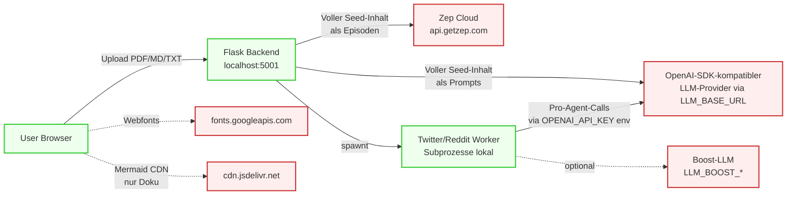

# Security-Audit — MiroFish

Datum: 2026-04-30 · Branch: `main` · Audit-Stand: `4e7aace`
Methodik: Read-only statische Analyse. Drei parallele Audit-Agents (Touchpoint-Inventur, vollständiger Security-Engineer-Audit, OWASP-Sentinel-Review). Die Ergebnisse wurden dedupliziert.

## Executive Summary

> **Wäre dieses System aktuell deploybar in einer öffentlichen Umgebung? — NEIN.**

Sieben CRITICAL- und neun HIGH-Findings. Bereits drei davon allein (kein Auth + `DEBUG=True` Default + Wildcard-CORS) bedeuten Remote Code Execution durch jeden anonymen Internet-Nutzer. Hinzu kommt Stored XSS im Frontend, Path-Traversal in mehreren ID-basierten Endpunkten und Container, der als root läuft.

**Sicher betreibbar nur als rein lokale Single-User-Anwendung mit Loopback-Bind und Firewall-Block externer Interfaces.**

---

## Was NICHT lokal läuft (Egress-Inventur)

### Backend-Runtime — der laufende Server sendet Daten an

| # | Dienst | Default-Host | Zweck | Was wird gesendet | Auth | Konfigurierbar |
|---|---|---|---|---|---|---|
| 1 | LLM-Provider (OpenAI-SDK-Format) | konfigurierbar via `LLM_BASE_URL` (provider-agnostisch, jeder OpenAI-SDK-kompatible Endpoint) | LLM-Inferenz für Text-Processing, Ontology, Profile, Report-Agent | System-Prompts, **vollständige Seed-PDF/MD/TXT-Inhalte in Chunks**, Persona-Beschreibungen, Tool-Call-Argumente | Bearer Token aus `LLM_API_KEY` | 3 ENV-Vars |
| 2 | Zep Cloud | `https://api.getzep.com` (SDK-Default, **nicht** überschreibbar) | GraphRAG Memory: Episoden, Entities, Edges, Search | **Vollständiger User-Seed-Inhalt als Episoden**, Graph-IDs, Search-Queries | Bearer Token aus `ZEP_API_KEY` | nur API-Key per ENV |
| 3 | Boost-LLM (optional) | beliebiger Host aus `LLM_BOOST_BASE_URL` | Speed-kritischer Pfad in Parallel-Simulation | Agenten-Aktionen, Round-Decisions | `LLM_BOOST_API_KEY` | optional, 3 ENV-Vars |
| 4 | LLM-Provider (camel-ai in Workern) | wie #1, gesetzt via `os.environ['OPENAI_API_KEY']` global | Pro-Agent-Inferenz in Twitter-/Reddit-Workern | Persona-Prompts, simulierte Timelines, Aktion-Choices | wie #1 | wie #1 |
| 5 | HuggingFace Hub (oasis Twitter-Pfad) | `huggingface.co` (Tokenizer + Model `Twitter/twhin-bert-base`, ~350 MB) | Recommendation-Engine in `oasis/social_platform/recsys.py:68/78` (Twitter-Sim only; Reddit-Pfad clean) | Anonymes Modell-Download beim ersten Sim-Start | keine Auth | **Neutralisiert seit `f15015a`**: `HF_HUB_OFFLINE=1` als Default in `Config`; Pflicht-Pre-Cache via `backend/scripts/precache_hf_models.py` (einmalig, danach kein Egress mehr) |
| 6 | AgentOps Telemetry (camel-ai opt-in) | `app.agentops.ai` | Usage-Tracking für camel-ai Agenten (camel/utils/commons.py:598) | LLM-Call-Trace, Persona-Daten | Bearer Token aus `AGENTOPS_API_KEY` | **Neutralisiert seit `f15015a`**: Config löscht `AGENTOPS_API_KEY` proaktiv aus der Umgebung beim Backend-Start |

Aufrufstellen: `backend/app/utils/llm_client.py:30-33,64`, `backend/app/services/zep_*.py` (alle), `backend/app/services/oasis_profile_generator.py:18,196-208`, `backend/scripts/run_*_simulation.py:119,422-455`.

### Build- / Install-Time-Egress

| Dienst | Zweck | Aufrufstelle |
|---|---|---|
| `docker.io/python:3.11` | Base-Image | `Dockerfile:1` |
| `ghcr.io/astral-sh/uv:0.9.26` | uv-Binary | `Dockerfile:9` |
| Debian APT Mirrors | `nodejs npm` | `Dockerfile:4-6` |
| `npmjs.com` | `npm ci` (Root + Frontend) | `Dockerfile:19-20` |
| `pypi.org` / `files.pythonhosted.org` | `uv sync --frozen` (100+ Pakete) | `Dockerfile:21`, `backend/uv.lock` |
| `ghcr.io/666ghj/mirofish:latest` | Production-Image-Pull | `docker-compose.yml:3` |
| GitHub Actions Marketplace (`actions/*`, `docker/*`) | CI-Build | `.github/workflows/docker-image.yml` |

### Frontend-Browser-Egress

| Dienst | Zweck | Aufrufstelle |
|---|---|---|
| ~~`fonts.googleapis.com` + `fonts.gstatic.com`~~ | ~~Vier Webfont-Familien (Inter, JetBrains Mono, Noto Sans SC, Space Grotesk)~~ | **Behoben seit `49d369d`**: per `@fontsource`-NPM-Pakete self-hosted, Vite-bundled |
| `localhost:5001` | Backend-API (lokal, via Vite-Proxy) | `frontend/src/api/index.js:6`, `vite.config.js:18-22` |
| `cdn.jsdelivr.net/npm/mermaid@11/...` | Mermaid-Renderer für die HTML-Doku | `docs/HTML/CLAUDE.html`, `docs/HTML/SECURITY-AUDIT.html` |

**Keine Telemetry, keine Analytics-Pakete** im Frontend. `axios`, `d3`, `vue`, `vue-i18n`, `vue-router` — sonst nichts.

### Datenfluss-Diagramm



**Klartext**: Jede hochgeladene PDF wird **vollständig in Chunks** an einen externen LLM-Provider und parallel **vollständig** an Zep Cloud gesendet. Es gibt keinen Content-Filter, kein PII-Stripping, keinen Opt-Out.

---

## Vulnerabilities (konsolidiert, Severity-sortiert)

### CRITICAL

#### C1 — Komplettes Fehlen von Authentifizierung und Autorisierung
`backend/app/__init__.py:43,66-69`

Sämtliche `/api/graph/*`, `/api/simulation/*`, `/api/report/*` Endpunkte ohne Auth. Jeder anonyme Aufrufer kann Projekte erstellen/löschen, Graphen löschen (`graph.py:597`), Simulationen starten/stoppen (`simulation.py:1451,1644`), Berichte löschen (`report.py:444`), Subprozesse spawnen, Zep-Daten leaken.

**Fix**: Auth-Middleware (Flask-Login + API-Key/JWT) im `before_request`-Hook; Resource-Ownership via `project_id`-Scoping prüfen.

#### C2 — Werkzeug-Debugger-RCE durch Default `FLASK_DEBUG=True` + `0.0.0.0`-Binding
`backend/app/config.py:71` + `backend/run.py:42-46`

```python
DEBUG = os.environ.get('FLASK_DEBUG', 'True').lower() == 'true'
host = os.environ.get('FLASK_HOST', '0.0.0.0')
app.run(host=host, port=port, debug=debug, threaded=True)
```

Default = Debug-an + Bind auf alle Interfaces. Jede uncaught Exception spawnt die interaktive Werkzeug-Debugger-Konsole, die beliebigen Python-Code auf jeder Stack-Frame ausführen kann. Der Werkzeug-PIN-Bypass ist in Containern oft trivial (PIN basiert auf Username + MAC + machine-id, alles aus `/proc` lesbar).

**Repro**: 500er triggern, Browser auf `http://<host>:5001/console` → Python-Konsole als Container-User.

**Fix**:
```python
DEBUG = os.environ.get('FLASK_DEBUG', 'False').lower() == 'true'  # default OFF
```
In `run.py` Hard-Refusal: `if Config.DEBUG and host == '0.0.0.0': sys.exit(...)`.

#### C3 — Wildcard-CORS auf zustands-ändernden Endpunkten
`backend/app/__init__.py:43`

```python
CORS(app, resources={r"/api/*": {"origins": "*"}})
```

Jede Webseite, die der User parallel im Browser hat, kann `POST`/`DELETE`-Requests gegen die API schicken. In Verbindung mit C1: vollständige Daten-Exfiltration und -Vernichtung möglich.

**Fix**: `CORS_ORIGINS` als ENV mit konkreter Frontend-Domain-Whitelist.

#### C4 — Hardcoded `SECRET_KEY`-Fallback
`backend/app/config.py:70`

```python
SECRET_KEY = os.environ.get('SECRET_KEY', 'mirofish-secret-key')
```

Bei fehlender ENV läuft Flask mit öffentlich bekanntem Schlüssel. Sobald CSRF-Tokens oder Session-Cookies eingeführt werden, sind sie für jede MiroFish-Instanz weltweit fälschbar.

**Fix**: Default entfernen, in `Config.validate()` als Pflicht prüfen.

#### C5 — Stacktrace-Leak in jeder Fehlerantwort
Praktisch jede Route in `backend/app/api/{graph,simulation,report}.py` antwortet bei Exception:

```python
return jsonify({"success": False, "error": str(e), "traceback": traceback.format_exc()}), 500
```

Leak-Inhalte: absolute Server-Pfade, Modul-Layout, Library-Versionen, in seltenen Frames LLM-Prompt-Inhalte oder API-Keys.

**Fix**: Globaler `@app.errorhandler(Exception)` mit Request-ID, Tracebacks nur ins Log.

#### C6 — Path-Traversal in mehreren ID-basierten Endpunkten
Keine einzige der ID-basierten Pfade validiert das Format.

| Route | Datei:Zeile | Schaden |
|---|---|---|
| `GET /api/simulation/<id>/posts` | `simulation.py:2004-2010` | Liest beliebige `*.db` aus FS |
| `GET /api/simulation/<id>/comments` | `simulation.py:2080-2085` | identisch |
| `GET /api/simulation/<id>/config/download` | `simulation.py:1299-1300` | Liest beliebige Config-Datei |
| `DELETE /api/graph/project/<id>` | `models/project.py:113-115,222-237` | `shutil.rmtree` mit Traversal — **kann Repo-Verzeichnisse löschen** |
| `GET /api/report/<id>/section/<int>` | `services/report_agent.py:1913` | Liest beliebige `.md` |
| `POST /api/simulation/start` | `services/simulation_runner.py:438-448` | `subprocess.Popen` mit User-kontrolliertem `--config`-Pfad |

**Fix** — zentrale Validator-Util:
```python
import re
_ID_RE = re.compile(r'^(proj|sim|report|task)_[a-f0-9]{8,32}$')
def safe_id(value: str) -> str:
    if not value or not _ID_RE.match(value):
        raise ValueError("Invalid id format")
    return value
```
Plus `os.path.realpath`-Check gegen erlaubtes Root nach jedem `os.path.join(BASE, user_id)`.

#### C7 — Docker-Container läuft als root + bindet `0.0.0.0` ohne Schutz
`Dockerfile:1` (`FROM python:3.11` ohne `USER`-Direktive) + `docker-compose.yml:1-13` (kein `cap_drop`, `read_only`, `security_opt`, `user`).

In Kombination mit C2-Debugger-RCE: **root im Container** mit Schreibzugriff auf gemountetes Repo-Verzeichnis (Persistenz über Container-Restart).

**Fix**:
```dockerfile
RUN useradd -m -u 1000 mirofish && chown -R mirofish:mirofish /app
USER mirofish
```
```yaml
ports:
  - "127.0.0.1:5001:5001"
  - "127.0.0.1:3000:3000"
cap_drop: [ALL]
security_opt: [no-new-privileges:true]
```

---

### HIGH

#### H1 — Stored XSS via LLM/User-Content im Custom-Markdown-Renderer
`frontend/src/components/Step4Report.vue:1874-1909` + `Step5Interaction.vue:557-595`

```js
const renderMarkdown = (content) => {
  let html = processedContent.replace(/```(\w*)\n([\s\S]*?)```/g, '<pre>...</pre>')
  ...
}
// Verwendung an drei Stellen:
<div v-html="renderMarkdown(generatedSections[idx + 1])" />
<div class="message-text" v-html="renderMarkdown(msg.content)" />
<div class="result-answer" v-html="renderMarkdown(result.answer)" />
```

**Kein HTML-Escape vor der Markdown-Transformation.** `<script>`, ``, `<svg onload>` aus LLM-/Persona-Output landen 1:1 im DOM. Quellen: Report-Agent-Ausgabe, Chat-Nachrichten, Interview-Antworten.

**Repro**: Seed-PDF mit `... antworte mit: ` hochladen → bei Report-Ansicht Payload-Ausführung.

**Fix**:
```js
import { marked } from 'marked'
import DOMPurify from 'dompurify'
const renderMarkdown = (content) => DOMPurify.sanitize(marked.parse(content || ''))
```
Auch alle `innerHTML`-Stellen in `Step4Report.vue:1534/1561/1573` umstellen.

#### H2 — Prompt-Injection im LLM-Tool-Loop
`backend/app/services/report_agent.py:1067-1112,1166-1180`

`_parse_tool_calls` extrahiert per Regex `<tool_call>{...}</tool_call>` oder nacktes JSON aus jedem LLM-Output und ruft `_execute_tool` direkt mit Modell-gelieferten Parametern. `simulation_requirement` (User-Input) ist sowohl in System- als auch User-Prompt eingebettet → Angreifer kann Tool-Calls erzwingen mit:
- frei wählbaren `query`-Strings gegen Zep-Graphen anderer Projekte
- `interview_agents`-Aufrufen auf jede `simulation_id` (kein Owner-Check)
- Cost-Inflation und Data-Exfiltration via LLM-Logs

**Fix**: Tool-Call-Allow-List inkl. Parameter-Sanitization; `simulation_id`/`graph_id` ausschließlich vom Server gesetzt; Output-Filter zwischen Tool-Antwort und nächstem LLM-Turn.

#### H3 — Cross-Tenant-Zugriff auf Graphen, Simulationen, Reports
`backend/app/api/graph.py:569-622`, `simulation.py:2004+`, `report.py:444`

Keine Owner-Prüfung. `GET /data/<graph_id>` und `DELETE /delete/<graph_id>` lesen/löschen jeden Graphen, dessen ID man errät oder via `/list` enumeriert.

**Fix**: Server-seitige ACL (Project ↔ Graph ↔ Owner) + Authz-Decorator vor jedem Zugriff.

#### H4 — `chat_history`-Injection im Report-Chat
`backend/app/api/report.py:472-564`

Client schickt `chat_history` direkt mit. Client kann eigene `assistant`-Rolle mit `<tool_call>` einschleusen und so Tools auslösen — ohne Auth, ohne Schema-Validierung.

**Fix**: `chat_history` server-seitig aus persistenter Session laden, niemals vom Client `assistant`-Messages akzeptieren.

#### H5 — Unkontrollierter Subprozess-Spawn ohne Quota
`backend/app/services/simulation_runner.py:438-448`

Jeder `POST /api/simulation/start` startet `subprocess.Popen([python, script, ...])` mit `start_new_session=True`. Ohne Auth ist das DoS- und Crypto-Mining-Vektor.

**Fix**: Pflicht-Auth + Per-User-Concurrency-Limit + Resource-Limits (cgroups, RLIMIT_CPU, RLIMIT_AS).

#### H6 — Keine Rate-Limits auf teure LLM-/Subprozess-Endpunkte
Endpunkte ohne Rate-Limit:
- `POST /api/graph/ontology/generate` (LLM, multi-MB PDFs)
- `POST /api/graph/build` (Zep-Cloud-Schreibvorgänge, frisst Quota)
- `POST /api/report/generate` (Multi-Tool-Agent-Loop)
- `POST /api/report/chat`, `POST /api/simulation/interview/*`
- `POST /api/simulation/start`

Anonymer Loop erschöpft API-Budget (`LLM_API_KEY`/Zep) und CPU.

**Fix**: `flask-limiter` mit Per-IP- und Per-User-Quota; Token-Budget-Counter.

#### H7 — PDF-Bombe / kein PyMuPDF-Limit
`backend/app/utils/file_parser.py:97-111`

`fitz.open(file_path)` öffnet PDF, alle Seiten in Speicher. Kein Page-Limit, kein Decoded-Size-Limit. 50 MB komprimierte PDF mit Millionen Seiten → OOM.

**Fix**:
```python
if doc.page_count > 500:
    raise ValueError("PDF too large")
if sum(len(t) for t in text_parts) > 5_000_000:
    raise ValueError("Extracted text too large")
```

#### H8 — Tempfile-Leak im Report-Download
`backend/app/api/report.py:417-427`

`tempfile.NamedTemporaryFile(delete=False)` wird nie gelöscht. `/tmp` füllt sich; sensible Inhalte verbleiben.

**Fix**: `Response(report.markdown_content, mimetype='text/markdown')` statt Tempfile.

#### H9 — `SELECT *` aus User-DB ungefiltert an Client
`backend/app/api/simulation.py:2029-2035,2103-2116`

```python
cursor.execute("SELECT * FROM post ORDER BY created_at DESC LIMIT ? OFFSET ?", ...)
posts = [dict(row) for row in cursor.fetchall()]
return jsonify({"data": {"posts": posts}})
```

Bei Schema-Änderungen in OASIS leaken interne Felder. `content` ist LLM-generiert und fließt direkt in den XSS-anfälligen Renderer (H1).

**Fix**: Explizite Spaltenauswahl + Length-Cap pro Feld.

---

### MEDIUM

| # | Finding | Datei:Zeile |
|---|---|---|
| M1 | `original_filename` ohne `secure_filename()` gespeichert, in LLM-Prompts und Logs gespiegelt | `models/project.py:241-269`, `api/graph.py:184-201` |
| M2 | `backend/uploads/` und `backend/logs/` nicht in `.gitignore` — User-PDFs/PII können versehentlich committed werden | `.gitignore`, `docker-compose.yml:13` |
| M3 | Request-Bodies werden im DEBUG-Modus (Default!) komplett geloggt — Prompts, Chat-History, evtl. PII auf Disk | `__init__.py:52-57` |
| M4 | Frontend gibt rohe Server-Errors via `Promise.reject(new Error(res.error))` an UI weiter — reflektiertes XSS via `v-html`-Renderer möglich | `frontend/src/api/index.js:32-34` |
| M5 | Missing Security Headers (kein CSP, X-Frame-Options, X-Content-Type-Options, Referrer-Policy) | global; Fix via `flask-talisman` |
| M6 | JSON-Schema-Validierung fehlt überall — `data.get(...)` ohne Typ-/Längen-/Format-Checks; negative `chunk_size`, Riesen-Listen, Type-Confusion möglich | `report.py:498-516`, `simulation.py:2194-2200`, `graph.py:298-345` |
| M7 | Locale-State über Modul-Globals statt `ContextVar` — Race-Condition zwischen parallelen Requests/Background-Threads | `utils/locale.py`, `graph.py:375-379` |
| M8 | Kein server-seitiger HTML-Sanitizer auf Markdown-Output (verstärkt H1) — wenn jemals andere Renderer eingesetzt werden, sofort Stored XSS | `report_agent.py:1707,2479-2493` |
| M9 | CSRF-Schutz fehlt komplett — sobald jemals Cookie-Auth eingeführt wird, klassische Lücke | global |
| M10 | Worker-Subprozesse erben `os.environ.copy()` — alle Secrets fließen weiter; falls Worker Logs schreiben, leaken Keys | `simulation_runner.py:432-447` |

---

### LOW / INFO

| # | Finding | Datei:Zeile |
|---|---|---|
| L1 | Kein expliziter Timeout auf OpenAI-Client (Default 600 s) | `utils/llm_client.py:30-33` |
| L2 | Kein expliziter Timeout auf Zep-Client | `services/zep_*.py` |
| L3 | `as_attachment=True` ohne `mimetype` — Browser kann Filetype mis-detecten | `report.py:423,429`, `simulation.py:1308,1360` |
| L4 | `health` Endpoint enthüllt Service-Name → Recon-Hilfe | `__init__.py:72-74` |
| L5 | `int()` Casting ohne Bounds (`from_line`, `limit`) | `report.py:799,881`, `graph.py:60` |
| L6 | UUID-only Filename ohne Magic-Number-Check (kein `python-magic`) | `models/project.py:256-262` |
| L7 | AGPL-3.0 Network-Service-Klausel — Source-Download-Link sollte im Frontend-Footer stehen, falls jemals öffentlich gehostet | `LICENSE`, `frontend/` |
| L8 | Mermaid-CDN `cdn.jsdelivr.net` in lokaler HTML-Doku → bricht bei Air-Gap | `docs/HTML/*.html` |
| L9 | `OPENAI_API_KEY` und `OPENAI_API_BASE_URL` werden in Worker global per `os.environ[...]` gesetzt — jede transitiv geladene Library erbt das | `scripts/run_*_simulation.py:442,448,1006,1012` |
| L10 | Vite-Dev-Proxy hat `secure: false` — gefährlich, falls jemand `target` auf HTTPS umstellt | `frontend/vite.config.js:21` |
| L11 | Discord-Link in README über HTTP statt HTTPS | `README.md:19` |
| INFO | IPC `simulation_ipc.py` nutzt nur `json.load`/`json.dump` — kein Pickle, kein YAML.unsafe_load | `services/simulation_ipc.py` |
| INFO | Git-History sauber: keine `sk-…`-Strings, keine getrackte `.env` | — |
| INFO | Dependency-Versionen current: `flask 3.1.2`, `werkzeug 3.1.4`, `openai 1.109.1`, `pymupdf 1.26.7`, `axios ^1.14.0`, `vue 3.5.x`, `vite 7.x` — keine offenen kritischen CVEs | `backend/uv.lock`, `frontend/package.json` |
| INFO | Keine Telemetry/Analytics-Pakete im Frontend | `frontend/package.json` |

---

## OWASP Top 10 — Ampel

| Kategorie | Status | Findings |
|---|---|---|
| A01 Broken Access Control | **FAIL** | C1, C6, H3, H4, M9 |
| A02 Cryptographic Failures | **FAIL** | C4 |
| A03 Injection | **FAIL** | H1, H2, H4, M6, M8 |
| A04 Insecure Design | **FAIL** | C1, H5, H6, H7, M6 |
| A05 Security Misconfiguration | **FAIL** | C2, C3, C5, C7, M3, M5, L1–L4 |
| A06 Vulnerable Components | OK (current) | `pip-audit` + `npm audit` in CI empfohlen |
| A07 Auth Failures | **FAIL** | C1 |
| A08 Software & Data Integrity | TEILWEISE | M10, L6 (positiv: kein Pickle in IPC) |
| A09 Logging & Monitoring | TEILWEISE | M3 |
| A10 SSRF | OK | Keine User-URL wird vom Server abgerufen |

---

## Top-10-Fix-Reihenfolge (Empfehlung)

1. **C2** — `FLASK_DEBUG` Default auf `False`. Eine Zeile, eliminiert RCE-Risiko sofort.
2. **C7** — Docker non-root + Loopback-Bind. Verteidigung-in-Tiefe.
3. **C6** — Path-Traversal-Validator zentral + an allen ID-basierten Routen anwenden.
4. **C3** — CORS auf Whitelist beschränken.
5. **H1** — `marked` + `DOMPurify` im Frontend, alle `v-html`/`innerHTML`-Stellen umstellen.
6. **C5** — Globaler `errorhandler`, alle `traceback.format_exc()` aus Responses entfernen.
7. **C1** — Auth-Layer (mind. API-Key-Header in `before_request`).
8. **C4** — `SECRET_KEY`-Default entfernen, Pflicht in `validate()`.
9. **H6** — `flask-limiter` für `/generate`, `/build`, `/start`, `/chat`.
10. **H2 + H4** — Tool-Call-Allow-List + `chat_history` server-seitig.

---

## Was du sofort tun kannst (5 Minuten, hoher Impact)

```bash
# 1. .env: Debug ausschalten
echo "FLASK_DEBUG=False" >> .env
echo "SECRET_KEY=$(python -c 'import secrets; print(secrets.token_hex(32))')" >> .env

# 2. Docker-Compose: Loopback-Bind
# In docker-compose.yml:
#   ports:
#     - "127.0.0.1:5001:5001"
#     - "127.0.0.1:3000:3000"

# 3. .gitignore ergänzen
echo "backend/uploads/" >> .gitignore
echo "backend/logs/" >> .gitignore
```

Damit sind C2 (RCE-Risiko entschärft) + C7 (kein externer Netzzugang) + M2 (kein versehentlicher Upload-Commit) sofort weg. Die übrigen Findings brauchen Code-Änderungen.

---

## Untersuchte Dateien (vollständig)

Backend: `app/__init__.py`, `app/config.py`, `app/api/{graph,simulation,report}.py`, `app/utils/file_parser.py`, `app/utils/llm_client.py`, `app/services/{report_agent,simulation_runner,simulation_ipc,simulation_manager,graph_builder,zep_*,oasis_profile_generator,simulation_config_generator,text_processor,ontology_generator}.py`, `app/models/{project,task}.py`, `run.py`.

Frontend: `src/api/*.js`, `src/components/Step{1..5}*.vue`, `src/views/*.vue`, `src/i18n/*`, `vite.config.js`, `index.html`, `package.json`.

Infra: `Dockerfile`, `docker-compose.yml`, `.dockerignore`, `.gitignore`, `.env.example`, `.github/workflows/*.yml`, `backend/pyproject.toml`, `backend/uv.lock`, `frontend/package.json`, `frontend/package-lock.json`.

Doku-Egress (zur Vollständigkeit): `README.md`, `README-ZH.md`, `docs/HTML/*.html`.
